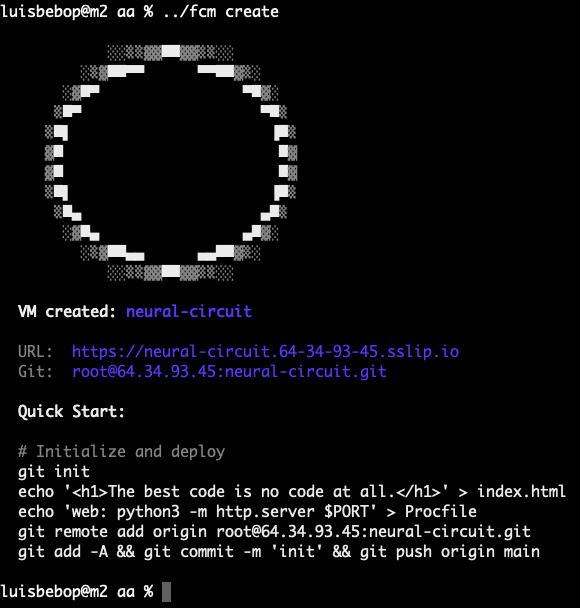

# fcm



A dead-simple CLI for running microVMs on bare metal. Create a VM, push your code, get a URL. That's it.

```
$ fcm create
VM created: cosmic-nova
URL: https://cosmic-nova.64-34-93-45.sslip.io

$ git push origin main
-----> Deploying to cosmic-nova...
-----> Detected Python (requirements.txt)
-----> Running pip install...
-----> Starting: gunicorn app:app
-----> Deploy successful!
       https://cosmic-nova.64-34-93-45.sslip.io
```

## What is this?

fcm is a Firecracker VM manager that gives you Heroku-style deploys on your own hardware. Each "app" runs in its own microVM with:

- **Instant boot** (~125ms) - Firecracker VMs are fast
- **Full isolation** - Real VMs, not containers
- **Git push deploy** - Just like Heroku
- **Auto SSL** - Free certs via Let's Encrypt
- **Persistent console** - SSH-like access that survives disconnects

No Kubernetes. No Docker. No YAML files. Just VMs.

## Quick Start

```bash
# Start the daemon (requires root)
sudo fcm daemon &

# Create a VM
fcm create

# Push your code
git init
echo "web: python3 -m http.server 8000" > Procfile
echo "<h1>Hello World</h1>" > index.html
git add . && git commit -m "init"
git remote add origin root@yourserver.com:cosmic-nova.git
git push origin main

# Access your VM's console
fcm console
```

## Commands

```
fcm create              Create a new VM (random name, port 8000 exposed)
fcm ls                  List all VMs
fcm console [vm]        Open persistent console session
fcm stop [vm]           Stop a VM
fcm start [vm]          Start a stopped VM
fcm destroy [vm]        Delete a VM and its data
fcm login               Authenticate with Google OAuth
fcm logout              Remove authentication token
fcm whoami              Show current user info
fcm daemon              Run the daemon (requires root)
```

When you run `fcm create` in a directory, it saves a `.fcm` file. After that, you can just run `fcm console`, `fcm stop`, etc. without specifying the VM name.

## Authentication

fcm uses Google OAuth for authentication. To get started:

```bash
# Login with your Google account
fcm login

# Check your current user
fcm whoami

# Logout when done
fcm logout
```

The login flow opens a browser for Google authentication. Your credentials are stored locally in `~/.fcm-token`.

## Installation (Bare Metal)

This guide assumes a fresh Ubuntu 22.04+ server with a public IP.

### 1. Install Dependencies

```bash
# Update system
sudo apt update && sudo apt upgrade -y

# Install build tools
sudo apt install -y build-essential curl git

# Install Rust
curl --proto '=https' --tlsv1.2 -sSf https://sh.rustup.rs | sh
source ~/.cargo/env
```

### 2. Install Firecracker

```bash
# Download Firecracker
FIRECRACKER_VERSION="v1.7.0"
curl -L "https://github.com/firecracker-microvm/firecracker/releases/download/${FIRECRACKER_VERSION}/firecracker-${FIRECRACKER_VERSION}-x86_64.tgz" | tar -xz

# Install binaries
sudo mv release-${FIRECRACKER_VERSION}-x86_64/firecracker-${FIRECRACKER_VERSION}-x86_64 /usr/local/bin/firecracker
sudo mv release-${FIRECRACKER_VERSION}-x86_64/jailer-${FIRECRACKER_VERSION}-x86_64 /usr/local/bin/jailer
rm -rf release-${FIRECRACKER_VERSION}-x86_64

# Verify
firecracker --version
```

### 3. Install Caddy (for SSL)

```bash
sudo apt install -y debian-keyring debian-archive-keyring apt-transport-https
curl -1sLf 'https://dl.cloudsmith.io/public/caddy/stable/gpg.key' | sudo gpg --dearmor -o /usr/share/keyrings/caddy-stable-archive-keyring.gpg
curl -1sLf 'https://dl.cloudsmith.io/public/caddy/stable/debian.deb.txt' | sudo tee /etc/apt/sources.list.d/caddy-stable.list
sudo apt update
sudo apt install -y caddy

# Start Caddy
sudo systemctl enable caddy
sudo systemctl start caddy
```

### 4. Install Additional Tools

```bash
# sshpass (for VM communication)
sudo apt install -y sshpass

# Docker (for building base image)
curl -fsSL https://get.docker.com | sh
sudo usermod -aG docker $USER
```

### 5. Build and Install fcm

```bash
# Clone the repo
git clone https://github.com/luisbebop/fcm.git
cd fcm

# Build
cargo build --release

# Install
sudo cp target/release/fcm /usr/local/bin/
```

### 6. Download the Kernel

```bash
sudo mkdir -p /var/lib/firecracker

# Download a pre-built kernel (or build your own)
curl -L "https://s3.amazonaws.com/spec.ccfc.min/img/quickstart_guide/x86_64/kernels/vmlinux.bin" \
  -o /tmp/vmlinux.bin
sudo mv /tmp/vmlinux.bin /var/lib/firecracker/vmlinux.bin
```

### 7. Build the Base Image

```bash
cd fcm/rootfs

# Build the rootfs (requires Docker)
sudo ./build.sh

# This creates /var/lib/firecracker/base-rootfs.img
```

### 8. Configure Networking

```bash
# Enable IP forwarding
echo "net.ipv4.ip_forward=1" | sudo tee -a /etc/sysctl.conf
sudo sysctl -p

# The daemon will create the bridge and NAT rules automatically
```

### 9. Configure SSH for Git Push

```bash
# Enable SSH environment variables (needed for git-receive-pack)
echo "PermitUserEnvironment yes" | sudo tee -a /etc/ssh/sshd_config
sudo mkdir -p /root/.ssh
echo "PATH=/usr/local/bin:/usr/bin:/bin:/usr/sbin:/sbin" | sudo tee /root/.ssh/environment
sudo chmod 600 /root/.ssh/environment
sudo systemctl restart sshd
```

### 10. Start the Daemon

```bash
# Run as root (required for network setup)
sudo fcm daemon

# Or run in background
sudo nohup fcm daemon > /var/log/fcm.log 2>&1 &
```

### 11. Set Up Admin Client (optional)

> **Note:** This step is only needed for admin access. Regular users should use `fcm login` with Google OAuth instead.

```bash
# Copy the admin token from the server
scp root@yourserver:/var/lib/firecracker/.token ~/.fcm-token

# Set the server address
export FCM_HOST="yourserver.com:7777"

# Test it
fcm ls
```

## How It Works

```
┌───────────────────────────────────────────────────────────┐
│                        Your Server                        │
├───────────────────────────────────────────────────────────┤
│                                                           │
│  ┌──────────┐   ┌──────────┐   ┌──────────┐               │
│  │   VM 1   │   │   VM 2   │   │   VM 3   │  Firecracker  │
│  │  :8000   │   │  :8000   │   │  :8000   │    microVMs   │
│  └────┬─────┘   └────┬─────┘   └────┬─────┘               │
│       │              │              │                     │
│       └──────────────┼──────────────┘                     │
│                      │                                    │
│                ┌─────┴─────┐                              │
│                │   fcm0    │  Bridge (172.16.0.1)         │
│                └─────┬─────┘                              │
│                      │                                    │
│                     NAT                                   │
│                      │                                    │
│  ┌───────────────────┴───────────────────┐                │
│  │                Caddy                  │                │
│  │  vm1.x.x.x.sslip.io → 172.16.0.50    │  Reverse        │
│  │  vm2.x.x.x.sslip.io → 172.16.0.51    │  Proxy+SSL      │
│  └───────────────────┬───────────────────┘                │
│                      │                                    │
└──────────────────────┼────────────────────────────────────┘
                       │
                    :443
                       │
                   Internet
```

## Procfile

Your app needs a `Procfile` that tells fcm how to start it:

```
web: python3 app.py
```

fcm auto-detects and installs dependencies:

| File | Action |
|------|--------|
| `requirements.txt` | `pip install -r requirements.txt` |
| `Gemfile` | `bundle install` |
| `package.json` | `npm install` |

The web process runs with `PORT=8000`.

## VM Specs

Each VM gets:
- 1 vCPU
- 1024 MB RAM
- 2 GB disk (sparse)
- 512 MB swap
- Python 3, Ruby, Node.js pre-installed

## Environment Variables

| Variable | Description |
|----------|-------------|
| `FCM_HOST` | Daemon address (e.g., `myserver.com:7777`) |
| `FCM_TOKEN` | Auth token (alternative to `~/.fcm-token`) |

## Troubleshooting

**"Connection refused" when running fcm commands**
- Make sure the daemon is running: `sudo fcm daemon`
- Check if FCM_HOST is set correctly

**"Permission denied" on git push**
- Copy your SSH key to the server: `ssh-copy-id root@yourserver`
- Or the daemon will show your public key to add

**VM won't start**
- Check if Firecracker is installed: `firecracker --version`
- Check if kernel exists: `ls /var/lib/firecracker/vmlinux.bin`
- Check if base image exists: `ls /var/lib/firecracker/base-rootfs.img`

**SSL not working**
- Make sure Caddy is running: `sudo systemctl status caddy`
- Check your server has ports 80 and 443 open
- sslip.io requires a public IP

## License

MIT
